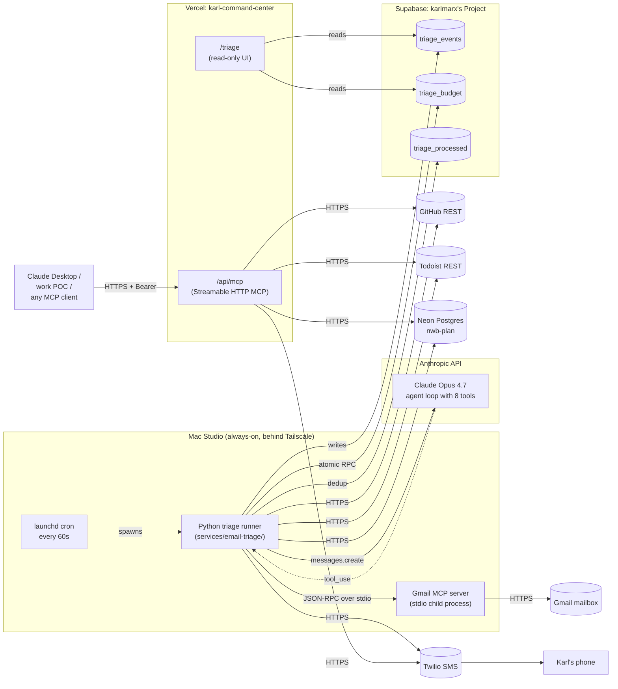
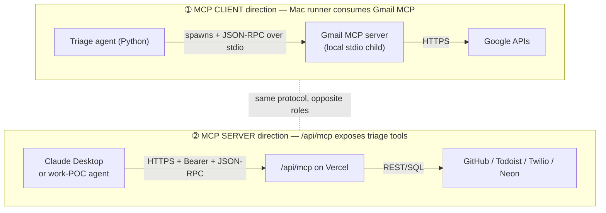
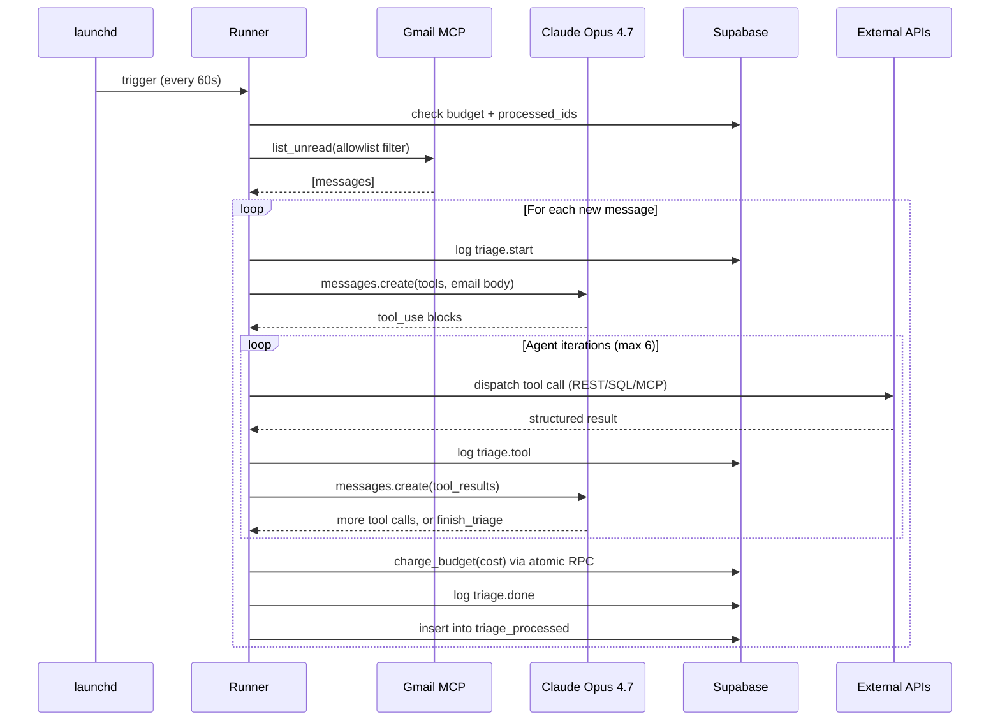
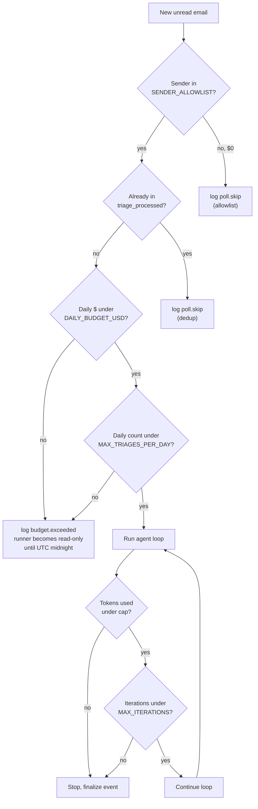
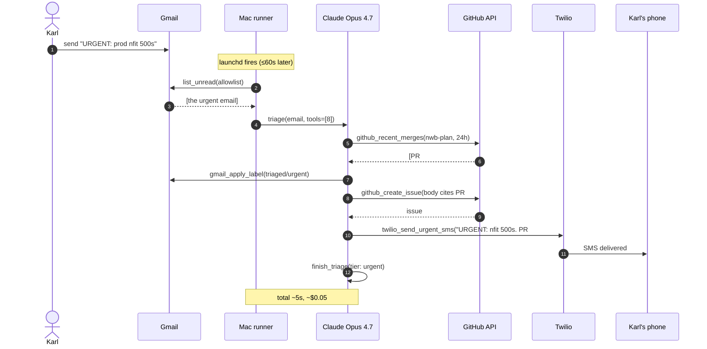
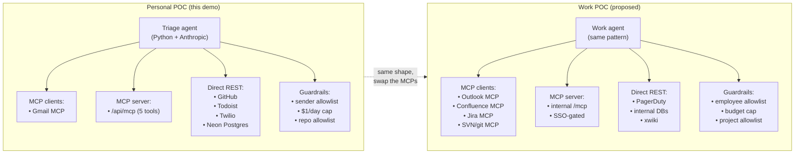

# Boss Demo Plan — Email Triage Agent

**Goal:** show that an MCP-based agent can do real work on real data, end-to-end,
with hard guardrails — and that the pattern transfers directly to the work POC.

**Runtime:** 18-22 min (added an MCP-server moment in Act 3). Live demo, mermaid
diagrams in this doc as backup.

**Companion runbook:** `services/email-triage/README.md` (internals).
**MCP server docs:** `karl-command-center/docs/mcp-server.md`.

---

## System architecture

One diagram for the entire system. Print this and have it in your hand during
the demo — it answers 80% of boss questions before they get asked.



## Two-way MCP — the part the boss needs to internalize

The demo shows **both directions of the MCP protocol** in the same product:



One is the agent USING someone else's tools. The other is the agent EXPOSING
its tools so other agents can use them. Both matter for the work POC — we'll
need to be both a client (consuming SVN/Jira MCPs) and a server (exposing our
workflow tools to ops/dev users).

---

## Pre-flight checklist (do these BEFORE walking in)

- [ ] Mac runner is running on launchd. Confirm: `launchctl list | grep triage`
      shows status `0` in the second column (last run succeeded). A non-zero
      number means the most recent run errored — check `~/Library/Logs/triage.err`.
- [ ] `tail -f ~/Library/Logs/triage.log` open in a Terminal pane (visible to
      you, not the projector).
- [ ] `/triage` dashboard open in browser, full-screen on the projector.
- [ ] Gmail open in another tab so you can flip to Drafts + Labels.
- [ ] Claude Desktop open on the laptop with `karl-triage` MCP server already
      connected. Test `tools/list` works before the meeting.
- [ ] Phone vibration tested on silent. The SMS is the showstopper; if you don't
      notice it, the moment falls flat.
- [ ] 5 demo emails staged in Gmail compose, addressed to yourself, ready to
      send one click at a time. See "Email scripts" below.
- [ ] Daily budget reset for visual impact:
      ```sql
      update triage_budget
         set spent_usd = 0, triage_count = 0
       where date = current_date;
      ```
- [ ] Vercel env vars set on karl-command-center production:
      - `SUPABASE_URL`, `SUPABASE_SERVICE_ROLE_KEY` (for /triage dashboard)
      - `MCP_BEARER_TOKEN` + `GITHUB_TOKEN` + `TODOIST_TOKEN` + `TWILIO_*` +
        `NWB_POSTGRES_URL` (for /api/mcp)
- [ ] Boss's calendar confirmed for 25 min, not 20.

---

## Act 1 — The Why (2 min, no live demo yet)

Open your actual Gmail inbox on the projector.

> "I get ~50 emails a day. Maybe 5 actually need me. The rest are receipts,
> marketing, and stuff I should reply to in two sentences but don't for three
> days. I built a triage agent that runs locally, watches my inbox, and does
> the obvious work — and importantly, it uses the same MCP pattern we're
> discussing for the work POC."

Frame the **pattern**, not just the product:

- Agent runs somewhere (Mac in my case, a Worker for work).
- Talks to external services through MCP servers (Gmail MCP here;
  Jira / Confluence / SVN at work).
- Has hard budget + scope guardrails (or it eats your money).
- Activity streams to a dashboard so you can audit what it did.
- Same tool surface can be exposed as an MCP server so other clients
  (Claude Desktop, the work POC) can use it too.

---

## Act 2 — Architecture in 90 seconds

Show the two diagrams above (system architecture + two-way MCP).

Three boxes to call out:

1. **Mac (launchd, every 60s)** — Python runner. Spawns the local Gmail MCP
   server over stdio. Runs a Claude Opus 4.7 agent loop with 8 tools.
2. **Tool layer** — 6 action tools (label, draft, Todoist task, GH issue,
   SMS, finish) + 2 diagnostic tools (recent merges, user activity). All
   parameterized + gated.
3. **Supabase + Vercel** — events log, dashboard, and a JSON-RPC MCP server
   that exposes the same tool surface to other clients.

Key callouts:

- **Drafts only.** No `gmail_send` tool exists in the codebase. Architectural,
  not a config flag.
- **Sender allowlist** is a hard filter *before* the agent sees the email.
  Two addresses. Anything else: $0, skipped, logged.
- **$1/day cap** via an atomic Postgres RPC. If a runaway loop hits the cap,
  the runner becomes read-only until UTC midnight.
- **`/api/mcp` requires bearer token**. The 5 server-exposable tools (no Gmail)
  are gated behind a shared secret; the karlmarx/* repo allowlist is frozen at
  build time.

### The agent loop in one diagram

Useful if the boss asks "so what does the agent actually DO?":



### Guardrails pipeline



Every branch except the green path is auditable in `/triage`. Boss can ask
"why didn't it process this one?" — the answer is one row in `triage_events`.

---

## Act 3 — Live demo, escalating complexity (12 min)

### Demo 1 — Routine receipt → label only (~$0.005)

**Send:** Subject `Receipt: Spotify Premium $11.99`, body is a fake receipt.

Watch `/triage`:
- `triage.start` → `triage.tool: gmail_apply_label(triaged/low)` → `triage.done`

In Gmail, show the `triaged/low` label on the email.

> "Cheapest path. No follow-up needed. Half a cent."

### Demo 2 — Personal note → draft created (~$0.01)

**Send:** Subject `lunch next week?`, friendly 1-paragraph body.

Dashboard sequence:
- Label → `gmail_draft_reply` → finish.

Open Gmail → Drafts. The draft is there. Read it aloud.

> "Agent decided this needed a personal reply, drafted one, and stopped. I'll
> review before hitting send. It *can't* send — that tool doesn't exist."

### Demo 3 — Bug report → GitHub issue auto-filed (~$0.02)

**Send:** Subject `foodr bug — meal log won't save on Safari`, body has
reproduction steps.

Dashboard:
- Label → `github_create_issue` (target: `karlmarx/foodr`) → finish.

Click the issue URL in the dashboard. Issue body has the repro steps from
the email, formatted.

> "Zero clicks from me. Lives in the right repo. Karl-the-developer can pick
> it up tomorrow without ever opening Karl-the-emailer's inbox."

### Demo 4 — THE AGENT SHOWSTOPPER (~$0.05)

**Send:** Subject `URGENT: prod nfit.93.fyi returning 500s`, body says
something broke after the latest deploy.

Talk over the dashboard while it runs:

1. **`github_recent_merges({repo: "karlmarx/nwb-plan", hours: 24})`** ← *pause*
   > "Watch this. It hasn't filed anything yet. It's asking GitHub what shipped
   > recently."
2. `gmail_apply_label("triaged/urgent")`
3. **`github_create_issue`** — open it. Show the body:
   > "Recent merges that may be related: PR #X (title), merged Yh ago."
4. **`twilio_send_urgent_sms`** — your phone buzzes. Show the SMS on the
   projector (AirPlay) or hold it up:
   > "URGENT: nfit 500s. PR #X merged Yh ago is suspect. <url>"
5. `finish_triage` — tier `urgent`, cost ~$0.05.

> "The agent connected the deploy to the breakage on its own. Not because I
> told it which PR — because the prompt says 'when something breaks, check
> what shipped first' and the recent-merges tool exists. That's MCP working."

#### The full sequence in one diagram

For reference if the boss wants to see what just happened:



### Demo 4.5 — THE MCP SERVER MOMENT (~3 min, free)

This is the bridge to the work POC. Switch from showing the autonomous Mac
runner to showing **Claude Desktop using the same tool surface manually**.

**Setup:** Claude Desktop is already connected to the `/api/mcp` route on
karl-command-center as an MCP server named `karl-triage`.

> **Pre-demo:** the canonical production URL is gated by Cloudflare Access
> (`https://command.93.fyi/api/mcp`), and the bare Vercel hostname is gated
> by Vercel Deployment Protection. Neither is reachable from Claude Desktop
> without help. Two options to make this work before the meeting:
>
> 1. **Protection-bypass automation** — generate a bypass token in the Vercel
>    project settings, then put both headers in the Claude Desktop config:
>    `Authorization: Bearer <MCP_BEARER_TOKEN>` *and*
>    `x-vercel-protection-bypass: <BYPASS_TOKEN>`. Confirm `tools/list`
>    works the night before; do **not** discover this at the meeting.
> 2. **CF Access service token** — generate a service token for
>    `command.93.fyi` and add `CF-Access-Client-Id` / `CF-Access-Client-Secret`
>    headers alongside the bearer.
>
> Either way, **test `tools/list` end-to-end from Claude Desktop before the
> demo**. The MCP route on the server is verified working; the deployment
> walls are what trip up an unprepared client.

1. Open Claude Desktop. Show the connected MCP server in the sidebar.
2. Type the prompt:
   > "Use my triage tools to check what's been merged to karlmarx/nwb-plan in
   > the last 48 hours, then file an issue in karlmarx/karl-infra titled
   > 'demo: MCP server reachable from Claude Desktop' that lists those
   > recent merges."
3. Claude Desktop calls:
   - `karl-triage.github_recent_merges({repo: "karlmarx/nwb-plan", hours: 48})`
   - `karl-triage.github_create_issue({repo: "karlmarx/karl-infra", ...})`
4. Click through to the issue. It's there.

> "Same agent loop, same tool dispatch — just driven from a different client.
> The Mac runner is a Python script that uses Anthropic's API and these tools.
> Claude Desktop is a different client that uses Anthropic's API and these
> same tools. The pattern is portable. *That* is what we'd build at work:
> tools that any LLM client can reach behind a bearer token, with a hard
> allowlist on which repos / databases / services they can touch."

### Demo 5 — Guardrail check ($0.00)

**Send:** From a non-allowlisted account (work account, old Gmail, anything),
to your monitored address. Subject doesn't matter.

Dashboard:
- `poll.skip` event, kind `allowlist`. Zero cost added.

> "Sender allowlist is a hard filter. Costs me nothing. Spam farms can't
> bankrupt me."

---

## Act 4 — Tie to the work POC (3 min)

Refresh `/triage`. Point at the budget bar (~$0.09 of $1.00 used after 4
triages).

> "Same shape as the work POC. The diagram is identical — only the MCP
> servers and the destination services change."



The Opus 4.7 agent loop + tool dispatcher + guardrails transfer directly.
The lift to wire up the work MCPs is the work of days, not weeks — most of
it is provisioning the upstream OAuth / SSO, not writing agent code.

---

## Anticipated questions

| Question | One-line answer |
|---|---|
| What if it hallucinates and files a bad issue? | Drafts only for emails. Issues are recoverable (close + delete). Allowlist + budget limit blast radius. |
| Why MCP specifically, not plain function calling? | Same servers work in Claude Desktop, this agent, and any future client (including the work POC). Avoids re-implementing Gmail / Jira / etc. per agent. |
| What stops it from sending an email? | The `gmail_send` tool isn't registered. Architectural, not config. Adding it would require a code change + PR review. |
| Prompt injection in email bodies? | Real risk. Mitigations: tool calls return structured data the agent must reason over, not free-form HTML rendering. Sender allowlist means injection only works from one of two accounts. For the work version we'd add a content scanner before the agent ever sees a message. |
| Cost at scale? | $0.04 per triage on Opus 4.7. At 50 triages/day = $2/day. Sonnet 4.6 is ~5x cheaper at near-identical quality on bounded tasks like this. |
| Who can call `/api/mcp`? | Anyone with the bearer token. We could add per-tool gating or per-client tokens for the work version. |
| What if the bearer token leaks? | Rotate `MCP_BEARER_TOKEN` in Vercel env vars; deployments roll within ~30s. |
| Can I see the code? | `github.com/karlmarx/karl-infra/tree/main/services/email-triage` (runner) + `github.com/karlmarx/karl-command-center/tree/main/app/api/mcp` (server). Walk through any file. |

---

## Email scripts (paste these into Gmail compose)

All From: your allowlisted Gmail unless noted. All To: yourself.

### Email 1 — Spotify receipt
```
Subject: Receipt: Spotify Premium $11.99

Thank you for your payment.

Plan: Spotify Premium
Amount: $11.99 USD
Date: <today>
Card ending in: ••••4242

Your next payment will be on <today + 30d>.
```

### Email 2 — Lunch ask
```
Subject: lunch next week?

Hey — back in town next Thursday/Friday. Free for lunch either day?
Was thinking Tacombi or that new ramen place on 4th. Let me know.
```

### Email 3 — Bug report
```
Subject: foodr bug — meal log won't save on Safari

Found a bug in foodr. When I tap "Save" on a new meal entry in Safari
(iOS 17), nothing happens. Works fine in Chrome. Console shows "Cannot
read properties of undefined (reading 'id')" coming from MealForm.tsx
line ~120. Not urgent but would be good to fix before the next demo.
```

### Email 4 — Urgent prod
```
Subject: URGENT: prod nfit.93.fyi returning 500s

Hey - I just tried to open the workout planner and the page is returning
a 500 on every route. Looks like something broke after the latest deploy.
Can you take a look? Lots of users hitting it right now.
```

### Email 5 — Non-allowlisted (send from another account)
```
Subject: Hi from outside the allowlist

You don't know me. This email tests that triage skips anything not from
Karl's allowlist.
```

### Demo 4.5 prompt for Claude Desktop
```
Use my triage tools to check what's been merged to karlmarx/nwb-plan in
the last 48 hours, then file an issue in karlmarx/karl-infra titled
"demo: MCP server reachable from Claude Desktop" that lists those
recent merges.
```

---

## What NOT to do

- Don't show Python code on the projector. Boss doesn't want to read code;
  the dashboard tells the story better.
- Don't promise the work version is "the same thing." It's the same *shape*.
  The different MCPs are the actual work.
- Don't demo on caffeine. The Opus loop takes ~5s per turn. Slow down. Use
  the pauses to narrate what the agent is "thinking."
- Don't open Demo 4 cold — always do Demos 1-3 first so the boss sees the
  baseline before the showstopper.
- Don't skip Demo 4.5 (Claude Desktop). It's the moment that connects this
  POC to the work proposal. Without it, you're showing a cute email tool
  instead of a portable architecture.

---

## Post-demo retrospective (fill in after)

- [ ] Boss reaction:
- [ ] Questions you couldn't answer:
- [ ] Work POC next steps agreed:
- [ ] Total demo cost (from `/triage` budget bar):
- [ ] Did Demo 4.5 (Claude Desktop / MCP server) land or feel like filler?
