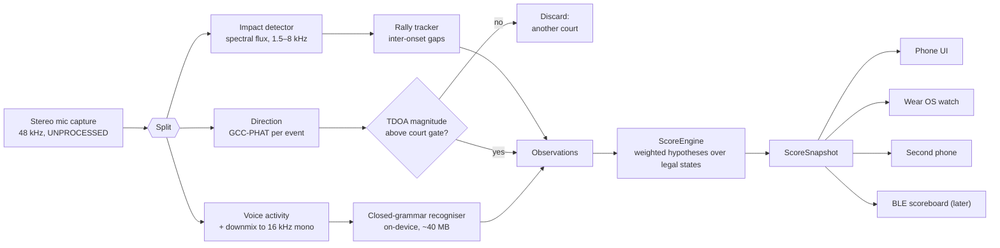
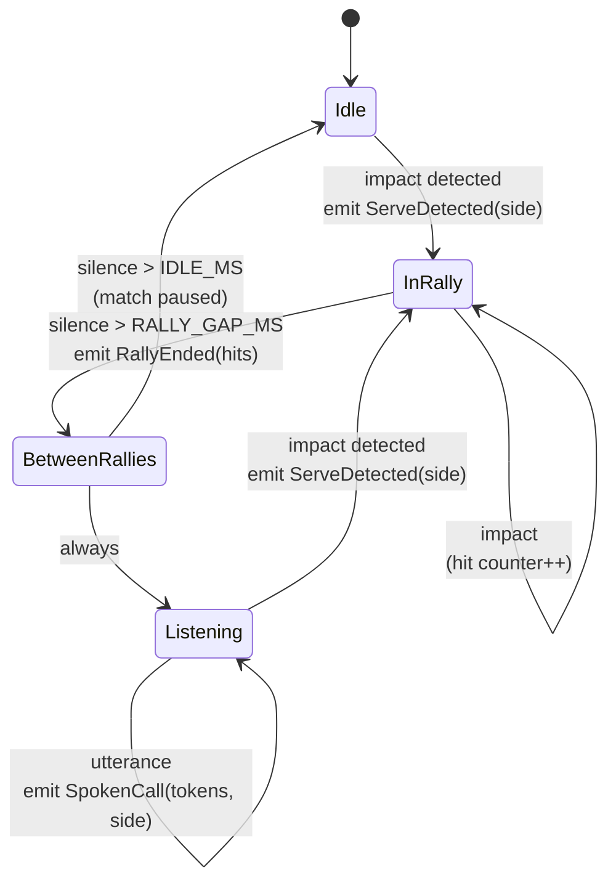
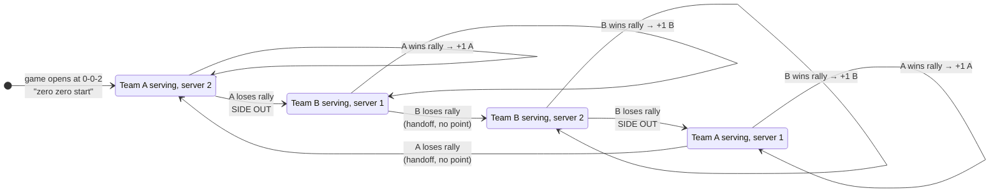
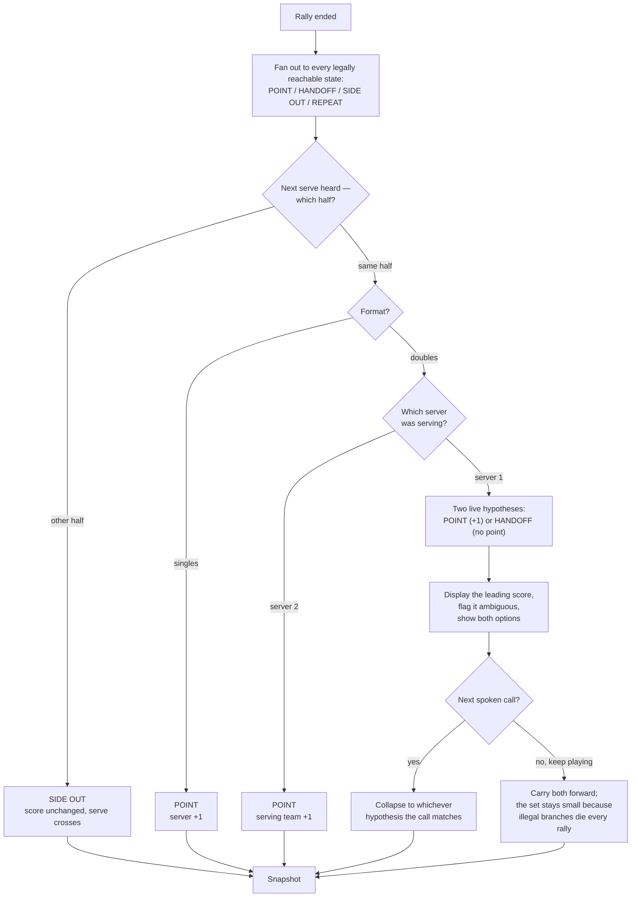
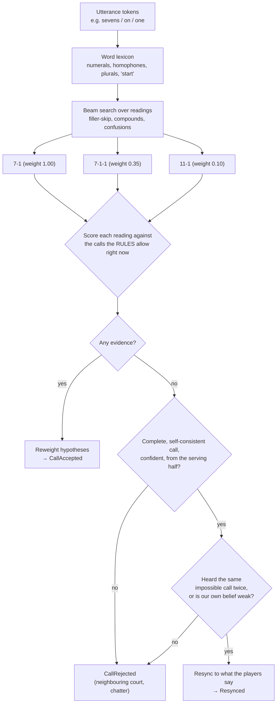
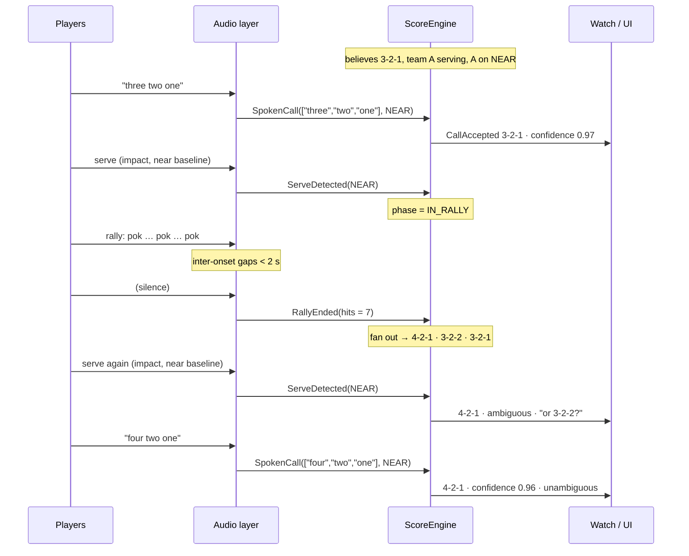
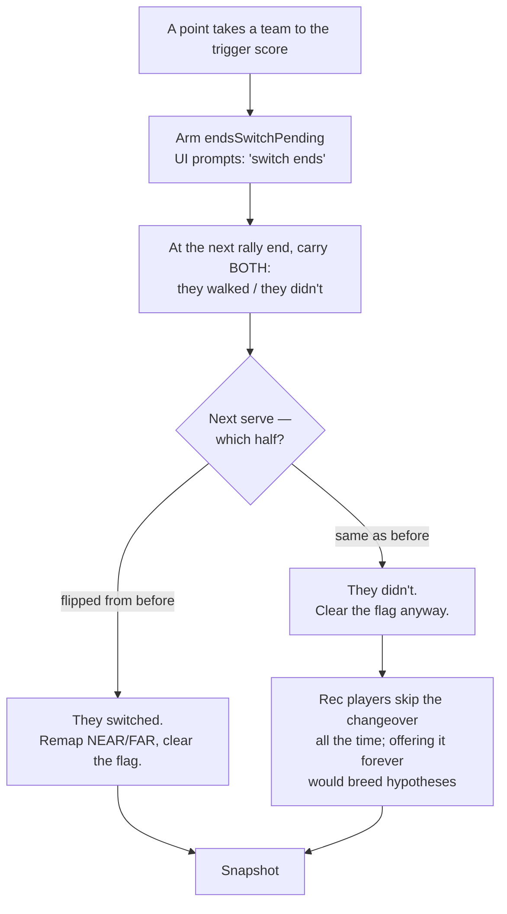
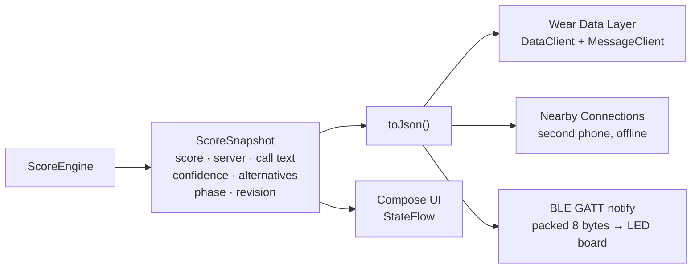

# Pickleball Voice Scorekeeper — Logic

Every diagram here is implemented by, or directly constrains, the Kotlin engine in
[`engine/`](engine/). Where a diagram states a rule, there is a test for it.

---

## 0. Physical setup this whole design assumes

```
                    FAR  (team on the far end)
        ┌───────────────────────────────────────────┐
        │                 baseline                  │
        │                                           │
        │        ●              ●                   │   far-side players
        │                                           │
        │- - - - - - - - non-volley zone - - - - - -│
        ├═══════════════════ NET ═══════════════════┤
        │- - - - - - - - non-volley zone - - - - - -│
   ┌────┤                                           │
   │📱  │        ●              ●                   │   near-side players
   └────┤                                           │
        │                 baseline                  │
        └───────────────────────────────────────────┘
                    NEAR (team on the near end)

   Phone sits at the net line on the sideline (net post, fence, or a cone),
   long axis pointing DOWN THE COURT — bottom mic toward NEAR, top mic toward FAR.
```

Three consequences fall straight out of that placement, and the whole system rests on them:

| Consequence | Why it matters |
|---|---|
| Our players sit at **endfire** to the two-mic array (±90° from broadside) | Time-difference-of-arrival between the mics is at its **maximum**, so NEAR vs FAR is a robust binary decision — not a fussy angle estimate. |
| Servers stand at the **baseline**, ~22 ft from the net line | The worst case for the array (a sound at broadside, delay ≈ 0) only happens at the net — where nobody calls the score from. |
| Adjacent courts are displaced **sideways**, i.e. near broadside | Their impacts and their shouting land at a TDOA magnitude near 0 and get gated out geometrically, before any of the scoring logic sees them. |

---

## 1. Signal chain



The engine's input alphabet is deliberately tiny — four facts, nothing else:

| Observation | Produced when | Carries |
|---|---|---|
| `ServeDetected` | first impact after a gap | which half of the court, direction confidence |
| `RallyEnded` | no impact for `RALLY_GAP_MS` | how many hits the rally had |
| `SpokenCall` | recogniser returns an utterance | word tokens, speaker's half, ASR confidence |
| `EndsSwitched` / `ManualCorrection` | the user taps | ground truth |

---

## 2. Rally detection state machine (audio layer)



Thresholds, all tunable at runtime:

| Constant | Value | Reasoning |
|---|---|---|
| `IMPACT_BAND` | 1.5–8 kHz | Paddle-on-ball is a broadband click with its energy well above voice fundamentals. |
| `IMPACT_ATTACK` | ≤ 3 ms rise | Separates a strike from a shout, a shoe squeak, or wind. |
| `RALLY_GAP_MS` | 2000 ms | Longest normal inter-hit gap (a high lob to the baseline) is ~1.4 s. |
| `IDLE_MS` | 45 s | Water break; the app keeps the score but stops expecting rallies. |
| `MIN_RALLY_HITS` | 2 | A single impact is a whiffed serve or a bounce, not a rally — the engine weights the "nothing happened" branch up in that case. |

**This is the "ball sound stopping and starting again" detector.** It never tries to say who won —
it only says *a rally ended* and *the next serve came from that side*. Everything else is inference.

---

## 3. Pickleball scoring rules, as the engine encodes them

Doubles, traditional side-out scoring. State is `(scoreA, scoreB, servingTeam, serverNumber)`; the
spoken call is `servingScore – receivingScore – serverNumber`.



Supporting rules the engine also enforces:

- **Only the serving team scores** (unless rally scoring is configured).
- **Serve box** is `RIGHT_EVEN` when the serving team's score is even, `LEFT_ODD` when odd.
- **Game** to 11 (or 15/21), win by 2, optional hard cap.
- **Change ends** the first time either team reaches 6 (games to 11).
- **Next game**: previous winner serves, ends switch, opening call is `0-0-2` again.
- **Singles** drops the server number entirely: the call is two numbers, and the server's box is
  again set by their own score's parity.

---

## 4. The core problem: a rally nobody called

The engine never observes who won. It observes **which half the next serve came from**. Map that
onto the state machine above and the following table is the entire inference:

| Format | Next serve from | Possible explanations | Resolved? |
|---|---|---|---|
| **Singles** | same half | serving player scored | ✅ unique |
| **Singles** | other half | side out | ✅ unique |
| **Doubles** | same half, server was #1 | point **or** handoff to server #2 | ❌ **ambiguous** |
| **Doubles** | same half, server was #2 | point (a handoff is impossible) | ✅ unique |
| **Doubles** | other half | side out | ✅ unique |



Two things make the doubles ambiguity survivable rather than fatal:

1. **It is only ever one bit wide, and it self-heals.** The very next call anyone makes collapses
   it. Uncalled rallies in a row don't multiply into chaos — a side out prunes every branch that
   disagreed about who was serving.
2. **We show it instead of hiding it.** The UI reads `4-2-1` with a chip underneath saying
   `or 3-2-2?`. Being honestly uncertain beats being confidently wrong.

> **Deliberately not attempted:** guessing the winner from rally acoustics (last-hit side, "the
> ball bounced twice"). It is unreliable and it is unnecessary — the serve tells us what we need.
> Speaker identification (which of the four voices called the score) *would* break the doubles tie,
> and is filed as a later enhancement, not a v1 dependency.

---

## 5. Spoken call → score, with no LLM anywhere



**The legality filter is the accuracy trick.** A closed ~40-word grammar plus "only score calls the
rules permit" removes most of the error space a general recogniser would leave behind:

- Heard `"seven eight one"` at 10-8-1 → 7-8-1 is not reachable, but the low-weight 7↔11 confusion
  reading **11-8-1** is. The call lands, and it happens to be game point.
- Heard `"sevens on one"` at 6-1-1 → readings `7-1` and `7-1-1`; only **7-1-1** is a legal
  successor. Sloppy speech, exact answer.
- Heard `"three two one"` while we are confidently at 7-5-2 → nothing legal explains it and it came
  from the receiving half. Rejected as another court, score untouched.

**Who is talking matters.** In pickleball the *server* calls the score, so the half of the court an
utterance came from is itself evidence about which team is serving. A call from the receiving half
is downweighted (to 0.35), not discarded — partners repeat the score all the time.

**Resync exists because we are not always right.** If the players say a score we believe is
impossible, and they say it twice — or they say it once while our own confidence is already weak —
they win. The engine jumps to their score and logs a `Resynced` event.

### Vocabulary the recogniser is restricted to

`zero one two … twenty` · `oh o nothing love nil zip none` · `won to too for fore ate tin nein` ·
`start` · `side out` · a handful of connectives (`score is and the at dash serving`).

That is ~60 words. No language model, no network, no per-use cost — the whole reason a closed
grammar is the right tool here rather than an LLM.

---

## 6. A rally, end to end



---

## 7. Change of ends

At 6 points the teams walk around the net — and `NEAR`/`FAR` stop meaning what they meant. Get this
wrong and every subsequent serve-side inference inverts.



The offer is made **once**, on the rally end that triggers it. The user can also just tap the
prompt, which applies the swap directly. Note that the *score* is unaffected either way — two
hypotheses that differ only in which end each team stands on display the same number, so the engine
groups them together and reports full confidence in the score even while it is unsure about the
geometry.

---

## 8. What the surfaces get



`revision` monotonically increases, so any receiver can drop out-of-order or stale packets without
coordination. Every transport ships the *same* snapshot — adding the LED scoreboard later is an
adapter, not a redesign.

---

## 9. Failure modes, and what happens

| Failure | Effect | Mitigation in the design |
|---|---|---|
| Adjacent court's ball strikes | Phantom serves/rallies | TDOA-magnitude gate — they arrive near broadside; plus level gate from calibration. |
| Adjacent court calls a score | Wrong score | Direction gate, then legality filter, then the two-strikes resync rule. |
| Nobody calls the score for a whole game | Ambiguity accumulates | Score shown with an explicit ambiguity chip; side outs prune; one tap fixes it. |
| Wind / fence rattle | False impacts | Attack-time and band constraints; a lone impact weights "nothing happened" up. |
| Phone kicked, orientation lost | NEAR/FAR inverted | Side mismatches are penalised, never deleted; a spoken call resyncs; UI shows a direction meter so it is visible. |
| Player has a quiet voice | Calls missed | Partial-call credit (2 of 3 numbers still scores), and silent-rally inference keeps running. |
| Doubles, uncalled rally, server #1 | Genuinely ambiguous | Displayed as ambiguous. Not papered over. |
| Recogniser mishears a numeral | Wrong score | Legality filter rejects it; confusion readings rescue the common pairs (7/11, 5/9, 3/13). |

---

## 10. Where the logic lives

| Concept | File |
|---|---|
| Teams, sides, state, calls, config | `engine/src/main/kotlin/.../Model.kt` |
| Rally transitions, legal successors, priors | `.../Rules.kt` |
| Word lexicon, homophones, confusions | `.../Numerals.kt` |
| Utterance → weighted readings → legality scoring | `.../CallGrammar.kt` |
| Weighted belief set, collapse, resync | `.../HypothesisTracker.kt` |
| Phases, events, undo, snapshots | `.../ScoreEngine.kt` |
| Observation/event/snapshot vocabulary | `.../Observations.kt` |
