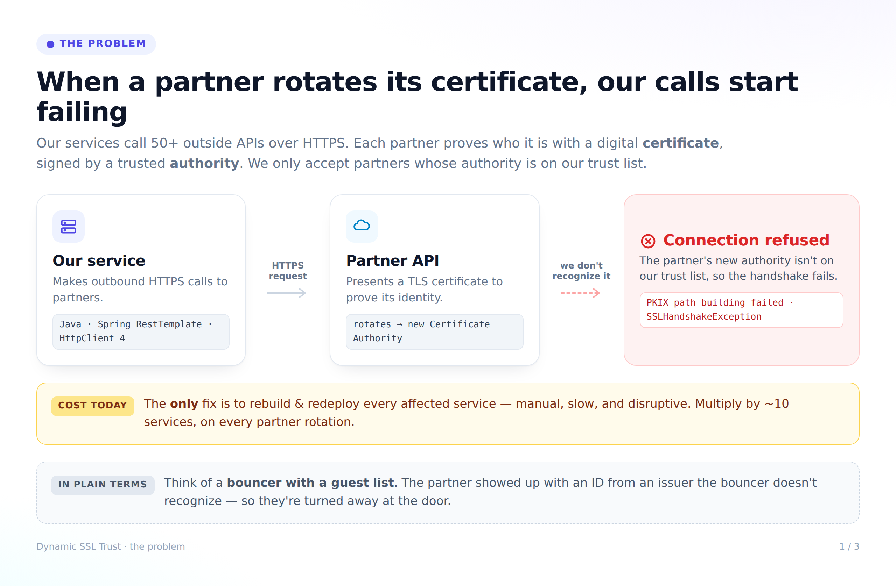
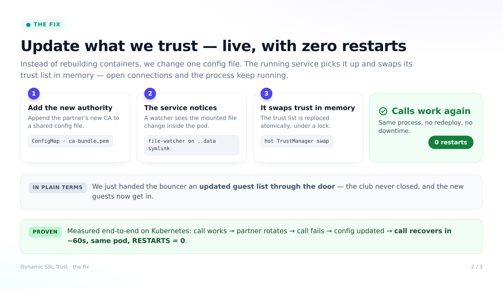
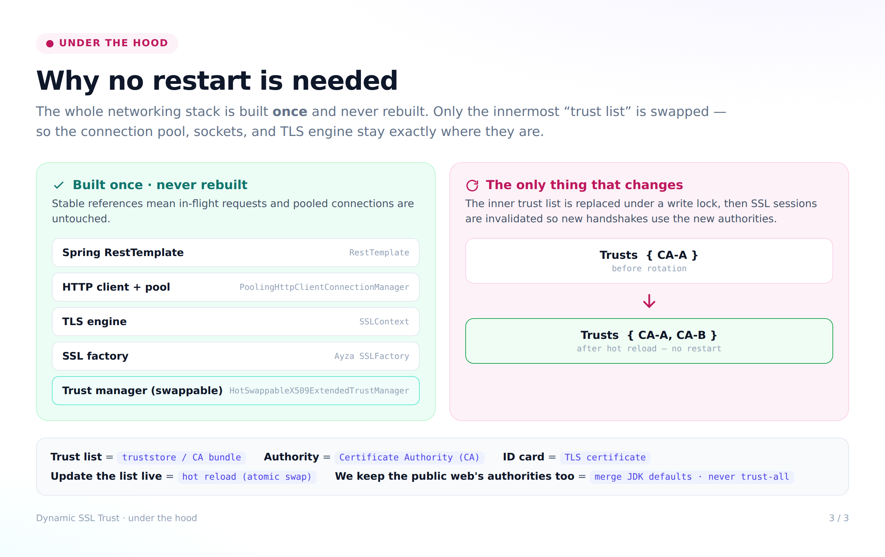
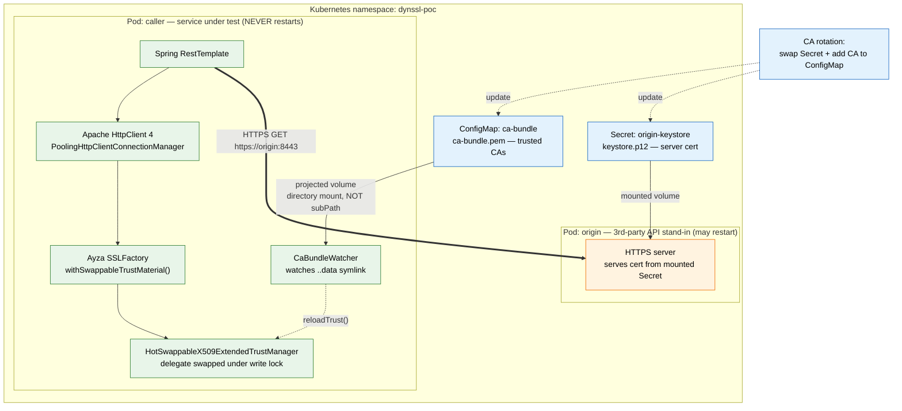
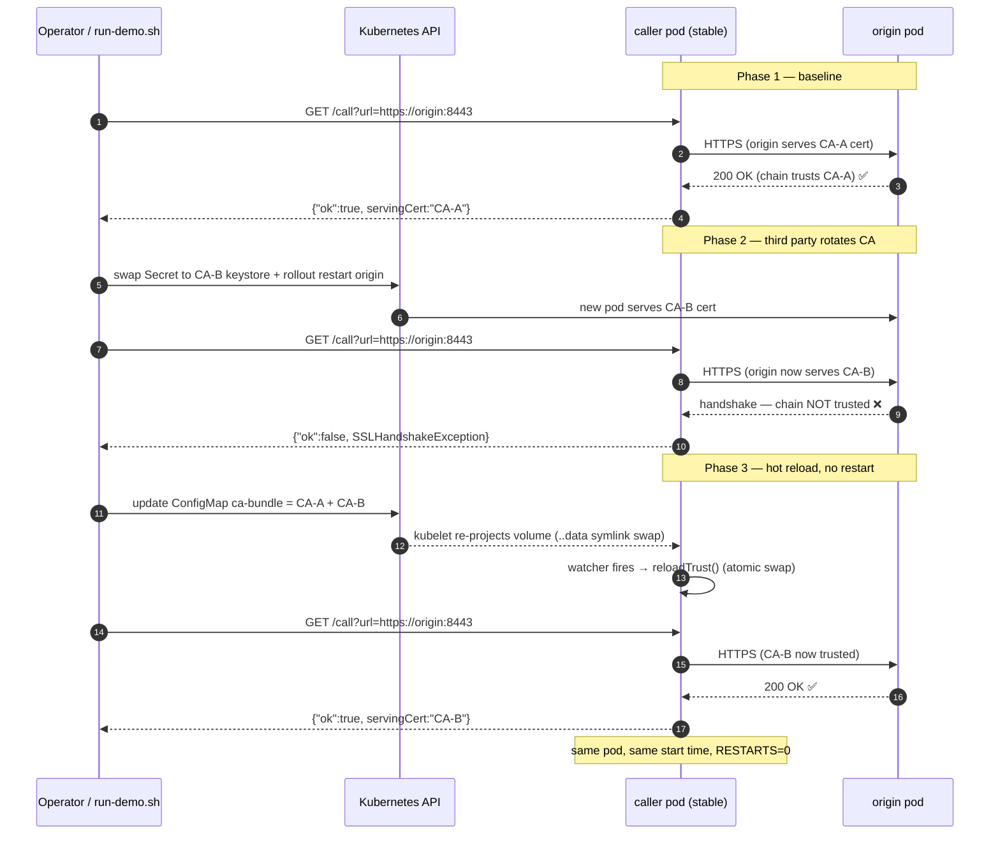
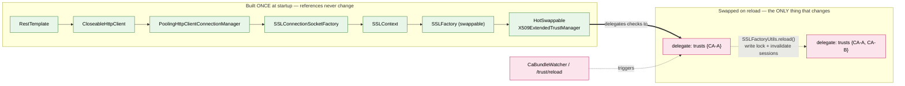
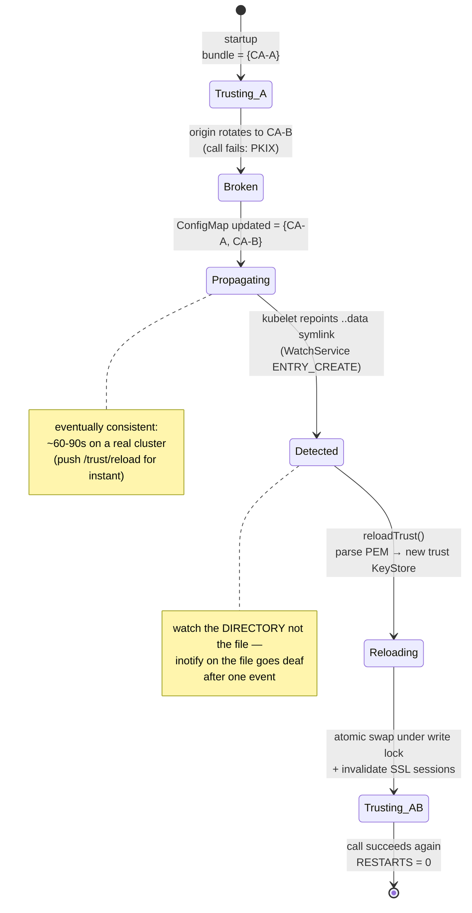

# Diagrams — Dynamic SSL Trust PoC

Two sets:
- **Explainer visuals** (below) — polished, for a mixed technical / semi-technical audience.
  Each element carries a plain-language line *and* the real technical term, with a running
  bouncer/guest-list analogy. Source: [`docs/visual/diagrams.html`](docs/visual/) →
  regenerate with `node docs/visual/render.mjs`.
- **Reference diagrams** (further down) — Mermaid, render inline on GitHub.

PNG exports live in [`docs/img/`](docs/img/).

---

## Explainer visuals (for presenting)

### 1 · The problem

### 2 · The fix

### 3 · Under the hood

---

## Reference diagrams (Mermaid)

---

## 1. System architecture

What is deployed and how data flows. The **caller** is the service under test (never
restarts); the **origin** is a stand-in third-party HTTPS API (may restart). The CA bundle
arrives as a ConfigMap; the origin's server cert arrives as a Secret.

---

## 2. The three-phase demo (what `run-demo.sh` proves)

The core scenario: a third party rotates its CA, the caller breaks exactly like production,
then recovers via a ConfigMap update — **with no restart**.

---

## 3. Why it works — the stable object graph + hot swap

The trick (from the report): build the `SSLContext → pool → client → RestTemplate` graph
**once** and never recreate it. Only the *innermost* trust manager's delegate is swapped,
under a write lock, so in-flight handshakes see old-or-new and the pool is undisturbed.

---

## 4. CA-bundle change → trust reload (the watcher path)

How a ConfigMap edit becomes a live trust swap, and why we watch the directory (the
`..data` symlink) rather than the file.

