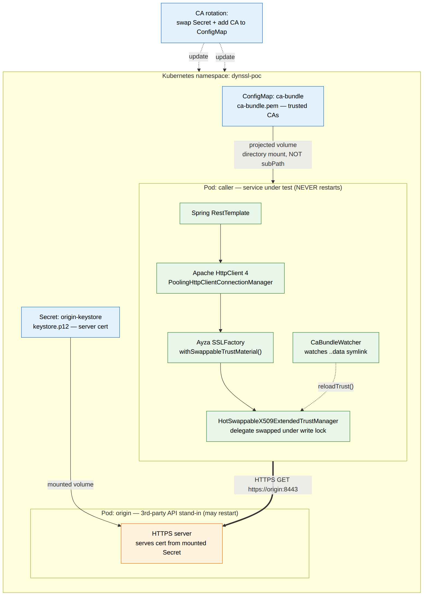

# Dynamic SSL Trust in Kubernetes — runnable PoC

A working proof of concept for the problem in
[`Dynamic_SSL_Trust_in_Java_Microservices`](../../): when a third party rotates its SSL
certificate to a **new CA**, Java services that captured their `SSLContext` at startup begin
failing with `PKIX path building failed` / `SSLHandshakeException`, and today the only fix is
to rebuild and redeploy the container.

This PoC proves the recommended fix end-to-end **in a real Kubernetes cluster**: a Java
microservice using **Apache HttpClient 4 + Spring `RestTemplate`**, with
[**Ayza** (`io.github.hakky54`, formerly sslcontext-kickstart)](https://github.com/Hakky54/ayza)
`withSwappableTrustMaterial()`, hot-swaps its trust material when a ConfigMap-mounted CA
bundle changes — **with zero pod restarts.**

> 📊 **Diagrams:** [DIAGRAMS.md](DIAGRAMS.md) (architecture, the 3-phase sequence, the
> hot-swap object graph, the trust state machine).
> 🎤 **Demoing it at work?** [DEMO.md](DEMO.md) is a laptop+kind runbook with talking points.



## What it demonstrates

| Phase | Action | Result |
|------:|--------|--------|
| 1 | Caller trusts **CA-A**; origin serves a **CA-A** cert | outbound HTTPS call **succeeds** |
| 2 | Third party "rotates" → origin now serves a **CA-B** cert (origin restarts) | call **fails** — `SSLHandshakeException`, the exact production bug |
| 3 | Add **CA-B** to the caller's CA-bundle **ConfigMap** | file-watcher hot-swaps trust → call **succeeds again** |
| ✅ | Throughout phase 3 | caller pod: **same pod, same start time, `RESTARTS=0`** |

## Architecture

```
                    dynssl-poc namespace
  ┌────────────────────────────┐        ┌──────────────────────────────┐
  │ caller  (under test)       │            │ origin  (3rd-party stand-in) │
  │ Spring RestTemplate        │  HTTPS │ HTTPS server, cert from a    │
  │  └ Apache HttpClient 4     │ ─────► │ mounted Secret (keystore.p12)│
  │     └ Ayza SSLFactory      │            │                              │
  │        withSwappableTrust  │            │ rotate CA = swap Secret +    │
  │ CaBundleWatcher (inotify)  │            │ restart (origin may restart) │
  └──────────┬─────────────────┘        └──────────────────────────────┘
             │ watches ..data symlink
  ConfigMap "ca-bundle" (PEM)  ── kubelet projects updates ──► /etc/ssl/ca-bundle/
```

The key insight (see the report's "core technical problem"): keep **one stable**
`SSLContext` → `SSLConnectionSocketFactory` → `PoolingHttpClientConnectionManager` →
`CloseableHttpClient` → `RestTemplate` object graph, and swap only the inner
`X509ExtendedTrustManager` under a write lock. HttpClient never notices; new handshakes use
the new CAs. See [`DynamicTrustHttpClient.java`](src/main/java/com/karl/dynssl/DynamicTrustHttpClient.java).

## Layout

```
pom.xml                         Maven build (Ayza + ayza-for-apache4 + HttpClient 4 + spring-web)
Dockerfile                      Alpine JRE image; one image, two modes (APP_MODE=caller|origin)
src/main/java/com/karl/dynssl/
  App.java                      mode dispatcher
  DynamicTrustHttpClient.java   the stable client + atomic trust hot-swap   ← the important bit
  CaBundleWatcher.java          watches the ConfigMap ..data symlink swap
  CallerApp.java                control API: /call /trust/info /trust/reload /healthz
  OriginApp.java                the third-party HTTPS stand-in
k8s/
  namespace.yaml  origin.yaml  caller.yaml      (ConfigMap + Secret are created by the script)
scripts/
  create-cluster.sh   spin up a throwaway kind/k3d cluster
  gen-certs.sh        generate CA-A, CA-B and the origin keystores (local only, gitignored)
  run-demo.sh         the full Phase 1→2→3 proof
  teardown.sh         clean up
```

## Run it

Prereqs: `docker`, `kubectl`, `mvn`, `openssl`, and `kind` (or `k3d`).

```bash
cd poc/dynamic-ssl-k8s
scripts/create-cluster.sh kind     # or: k3d
scripts/run-demo.sh
```

`run-demo.sh` builds the jar + image, loads it into the cluster, deploys both services, and
walks through all three phases, ending with the no-restart proof. Tear down with
`scripts/teardown.sh`.

### Poking at it by hand

```bash
kubectl -n dynssl-poc exec deploy/caller -- wget -qO- "http://localhost:8080/trust/info"
kubectl -n dynssl-poc exec deploy/caller -- wget -qO- "http://localhost:8080/call?url=https://origin:8443/"
# force an immediate reload instead of waiting for the watcher:
kubectl -n dynssl-poc exec deploy/caller -- wget -q --post-data= -O- "http://localhost:8080/trust/reload"
```

## Why this is the right approach (from the report)

- **Truly avoids restarts.** Infra-only fixes (Stakater Reloader, system-CA symlink) still
  roll the pod; this does not.
- **Thread-safe.** Ayza's `HotSwappableX509ExtendedTrustManager` guards the delegate with a
  `ReentrantReadWriteLock`; an in-flight handshake sees old *or* new, never torn state.
- **Keeps the public web PKI.** We merge `withDefaultTrustMaterial()` (JDK cacerts) with the
  rotating bundle — so `acceptedIssuerCount` is ~145 (defaults) **+ the PoC CAs**, and we
  never `trust-all`.
- **`X509ExtendedTrustManager`**, not plain `X509TrustManager`, so SNI/hostname checks are
  preserved.

## Production notes / honest caveats

- **Mount the bundle as a directory, never `subPath`** — `subPath` ConfigMap mounts never
  receive updates. (`caller.yaml` does this correctly.)
- **Propagation is eventually-consistent.** A ConfigMap volume update lands after the kubelet
  sync (~60–90s on a real cluster; it was a couple of minutes in the constrained CI sandbox
  this was first proven in). For sub-second control use the push endpoint (`/trust/reload`)
  driven by your config system instead of waiting on the kubelet.
- **The watcher reacts to the `..data` symlink swap**, not the file — inotify on the file
  alone goes deaf after one event ([CaBundleWatcher.java](src/main/java/com/karl/dynssl/CaBundleWatcher.java)).
  A simple poller is an equally valid, even-more-robust alternative.
- **Deliver the bundle with cert-manager `trust-manager`** in a real setup so rotating a CA
  is a one-line PEM change that fans out cluster-wide; this PoC creates the ConfigMap directly
  to keep moving parts minimal.
- This uses Ayza `10.0.5`; the Java package namespace is still `nl.altindag.ssl.*`.

## TROUBLESHOOTING — running inside a constrained / nested sandbox (cgroup v1)

On a normal machine you do **not** need any of this. But if your cluster nodes run inside a
cgroup-v1 docker-in-docker sandbox (some CI runners), pods may fail to start. The fixes that
made this PoC run in exactly such an environment:

1. **`runc: can't get final child's PID from pipe: EOF`** caused by
   `write /proc/.../oom_score_adj: permission denied` (the sandbox forbids lowering the OOM
   score). Fix: set **`restrict_oom_score_adj = true`** in containerd's CRI config
   (k3s: a `config.toml.tmpl` override).
2. **cgroup v1 + no cgroupns** → run the k3s/kind node container with **`--cgroupns=private`**.
3. **Registry TLS intercepted by a proxy** → point the node's containerd at the proxy CA
   (k3s `registries.yaml` `configs.<registry>.tls.ca_file`) or preload images with
   `ctr -n k8s.io images import`.

These are sandbox quirks, not anything the application or the manifests need.
